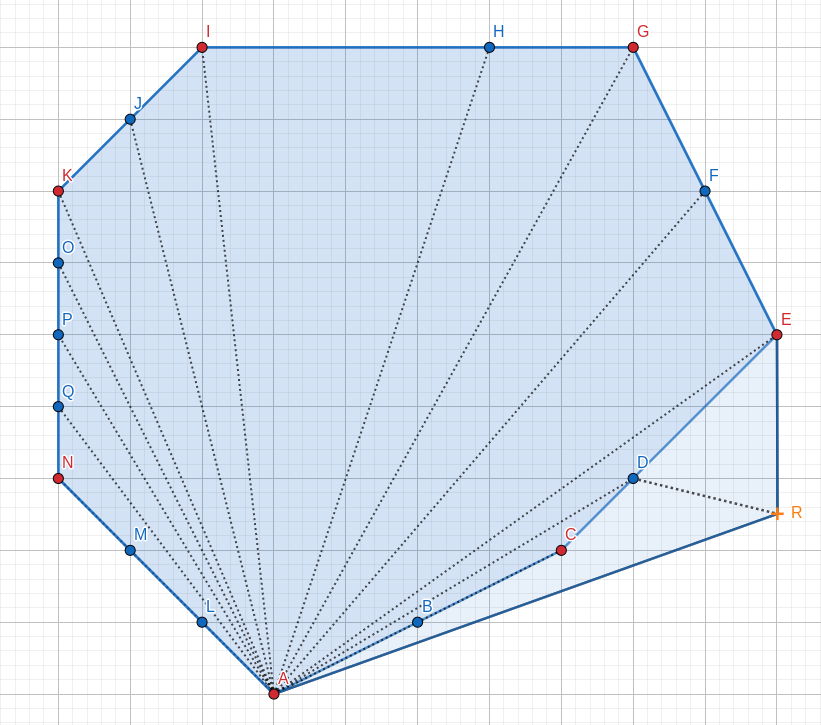
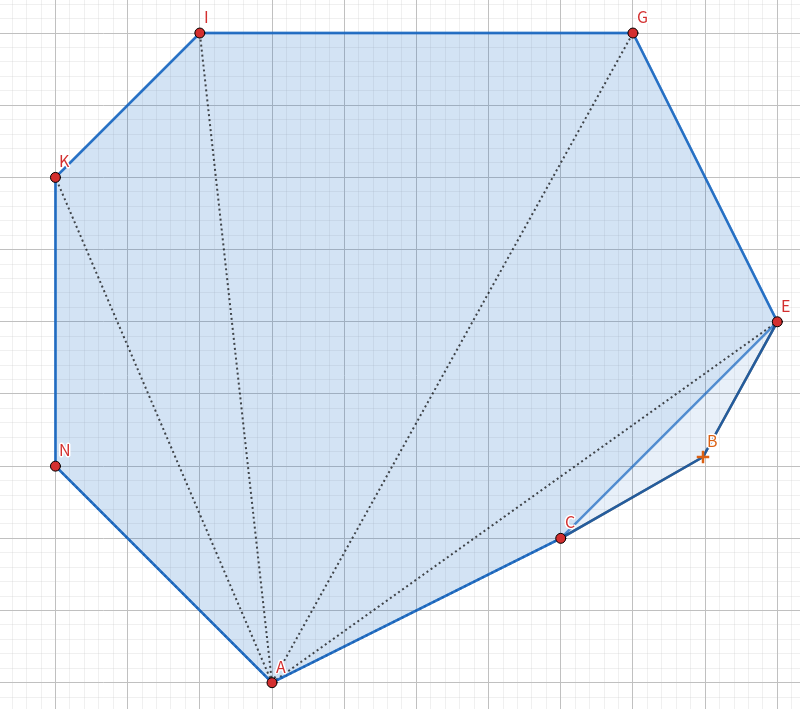
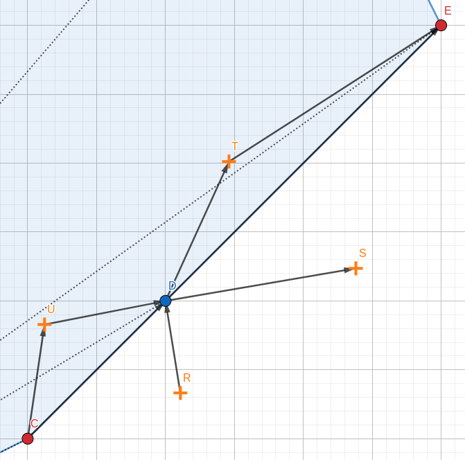

# [POJ1228] 爷爷的遗产

??? Quote "题面"

    ## 题面
    
    ### 链接
    
    [POJ](http://poj.org/problem?id=1228)

    [Vjudge](https://vjudge.net/problem/POJ-1228/)

    ### 题目描述

    卡姆兰是他祖父唯一在世的后代，他继承了祖父所有的财产。最有价值的是在爷爷出生地的一块凸多边形农场。这个农场的边界最初是用一根粗绳子和多边形边界上的一些钉子连接起来。但是，当卡姆兰去参观他的农场时，他注意到绳子和一些钉子不见了。你的任务是写一个程序来帮助卡姆兰决定他的农场的边界是否只能由剩余的钉子来确定。

    ### 输入

    输入文件的第一行包含一个整数 $t\ (1 \leq t \leq 30)$，即数据数量，然后是每个数据的输入数据。每个测试数据的第一行包含一个整数 $n\ (1 \leq n \leq 1000)$，它是剩余钉子的数量。接下来，有 $n$ 行，每一个钉子有一行，每个包含一对整数，这是钉子的 $x$ 和 $y$ 坐标。

    ### 输出

    每个测试数据应该有一个输出行，包含 `YES` 或 `NO`，这取决于是否可以从输入数据中唯一地确定农场的边界。

    ### 输入样例

    ```
    1
    6 
    0 0
    1 2
    3 4
    2 0
    2 4 
    5 0
    ```

    ### 输出样例

    ```
    NO
    ```

    ### 数据说明

    数据与原题有出入，原题的数据只有凸包上的点，而这里的数据内部也有点，所以，这里要先求凸包，再判断。

## 题解

### 稳定凸包

给定一个凸包 $H$，添加一个点 $S$，若添加后不能用所有的点构造一个凸包，则称凸包 $H$ 是稳定的。

如图，是一个稳定凸包：

添加点 $R$，点 $B, C, D$ 不再在凸包中。

{width="500px"}

如图，不是一个稳定凸包：

添加点 $B$，原凸包中所有的点都在新凸包中。

{width="500px"}

### 稳定凸包在题目中的应用

若剩余的钉子形成一个稳定凸包，则若有消失的钉子在凸包外，则不能再用全部的钉子构成凸包，和爷爷曾经的农场是一个凸包矛盾。故用剩余的钉子即可确定一个农场，答案为 `YES`。

相反，若是不稳定凸包，则可能还有消失的钉子出现，改变凸包的形状，故答案为 `NO`。

### 稳定凸包的求法

从上文稳定凸包的图中不难看出，稳定凸包的每条边上至少有三个点。

简单证明：



1. 若新加点在 $CD$ 左侧时，即点 $U$：

    $$\overrightarrow{CU} \times \overrightarrow{UD} < 0$$

    则 $U$ 不在凸包中。

1. 若新加点在 $CD$ 右侧时，即点 $R$：

    $$\overrightarrow{RD} \times \overrightarrow{DE} < 0$$

    则 $D$ 不在凸包中。

1. 若新加点在 $DE$ 左侧时，即点 $T$：

    $$\overrightarrow{DT} \times \overrightarrow{TE} < 0$$

    则 $T$ 不在凸包中。

1. 若新加点在 $DE$ 右侧时，即点 $T$：
