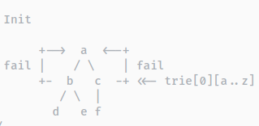

# zhangtianli's blog

!!! note ""
    ### [[ 题解 ] [ 计算几何 ] [ POJ1228 ] 爷爷的遗产 Grandpa's Estate ( 稳定凸包 )](./POJ1228_GrandpasEstate/main.md)

    {: align=left }

    **摘要**: [BZOJ3028 食物 food] 生成函数入门题

    明明这次又要出去旅游了，和上次不同的是，他这次要去宇宙探险！我们暂且不讨论他有多么 NC，他又幻想了他应该带一些什么东西。...
    [题目链接](https://www.lydsy.com/JudgeOnline/problem.php?id=3028)

!!! note ""
    ### [[ 题解 ] [ 数学 ] [ BZOJ3028 ] 食物 food ( 生成函数入门 )](./BZOJ3028_food/main.md)

    {: align=left }

    **摘要**: [BZOJ3028 食物 food] 生成函数入门题

    明明这次又要出去旅游了，和上次不同的是，他这次要去宇宙探险！我们暂且不讨论他有多么 NC，他又幻想了他应该带一些什么东西。...
    [题目链接](https://www.lydsy.com/JudgeOnline/problem.php?id=3028)

!!! note ""
    ### [[ 题解 ] [ HNOI2015 ] [LuoguP3239] 亚瑟王 ( 概率dp )](./HNOI2015_YaSeWang/main.md)

    **摘要**：$f_i = 1 - (1 - p_i)^{r-j}$ 

    P3239 HNOI2015 亚瑟王 概率dp 小 K 不慎被 LL 邪教洗脑了，洗脑程度深到他甚至想要从亚瑟王邪教中脱坑。 他决定，在脱坑之前，最后再来打一盘亚瑟王。既然是最后一战，就一定要打得漂 亮。众所周知，亚瑟王是一个看脸的游戏，技能的发动都是看概率的。 ...

!!! question ""
    {:align=right}
    ### [[ 算法 ] 细说最短路](./SP/main.md)

    **摘要**： 最短路问题是信息学竞赛中一个十分重要的问题。在非常多的题目和其他算法、数据结构中都有涉及。最短路算法也是信息学竞赛中的一个难点，对思维能力和代码能力有极大考验和锻炼。目前在网络上没有一个非常完整的最短路详解，各个算法书中也缺乏一些详细的图像和代码来解释，更缺少一些特殊优化及时间复杂度和正确性的详解或证明。本文尝试弥补这些信息的缺失，将会详尽地展示最短路算法的定义、思路、实现、优化和证明等内容。

!!! abstract ""
    {:align=left}
    ### [[ 数据结构 ] 树状数组](./BIT/main.md)

    **摘要**： [ 数据结构 ] 树状数组 树状数组(Binary Indexed Tree(B.I.T), Fenwick Tree)是一个查询和修改复杂度都为Log(N)的数据结构。主要用于查询任意两位之间的所有元素之和，但是每次只能修改一个元素的值；经过简单修改可以在Log(N)的复杂度下进行范围修改，但是这时只能查询其中一个元素的值。

!!! question ""
    {:align=right}

    ### 模板

    **[[ 模板 ] 替罪羊树](./template/tzy_tree.md)**

    **[[ 模板 ] [ 字符串 ] SAM (后缀自动机)](./template/sam.md)**
    
    **[[ 模板 ] [ 字符串 ] Manacher (马拉车)](./template/manacher.md)**
    
    **[[ 模板 ] [ 字符串 ] AC 自动机](./template/ac.md)**

!!! info ""
    {:align=right}
    ### 具体数学

    **[[ 具体数学 ] 0：前言](./concrete_maths/0.md)**《具体数学》是一本在大学中广泛使用的经典数学教科书

    **[[ 具体数学 ] 1：递归式与封闭式](./concrete_maths/1.md)** 汉诺塔(HANOI) | 平面上的直线(LINE) | 递归式与封闭式

    **[[ 具体数学 ] 2：和式与封闭式](./concrete_maths/2.md)** 和式 成套方法 解决将和式转为封闭式的方法

!!! quote ""
    ### [powerlevel10k: 最好看，方便，实用的命令行主题](./P10k/main.md)

    **摘要**： [项目地址](https://github.com/romkatv/powerlevel10k)

    ```text
    ╭─ ~                                          ✓  8.86  64°C  3.61 GHz  3.95G  
    ╰─
    ```